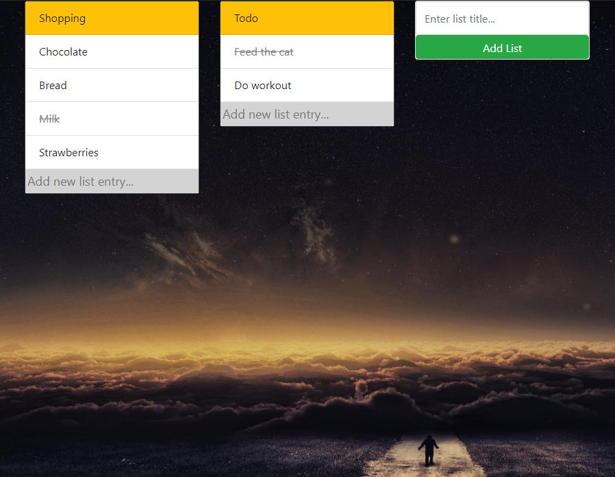

# Todo List
## Description
RESTful CRUD TODO-List app for writing down your daily goals!



## Tech stack
- nodejs
- expressjs
- mongoDB
- bootstrap 4
- jQuery

## Requirements for running the app:
1. Clone repo
1. Install node.js
2. Install mongoDB
3. Inside cloned project folder run: 
```
$ npm install
$ node app.js
```
5. Go to http://localhost:3000/todos and write down your tasks!
